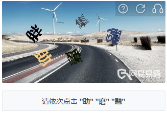
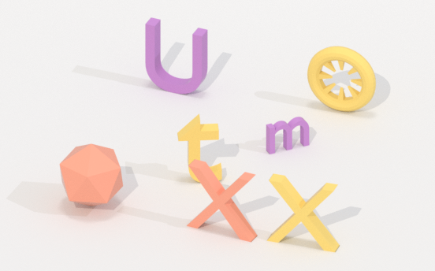
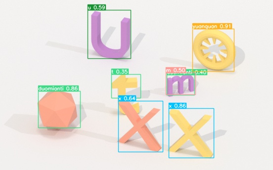
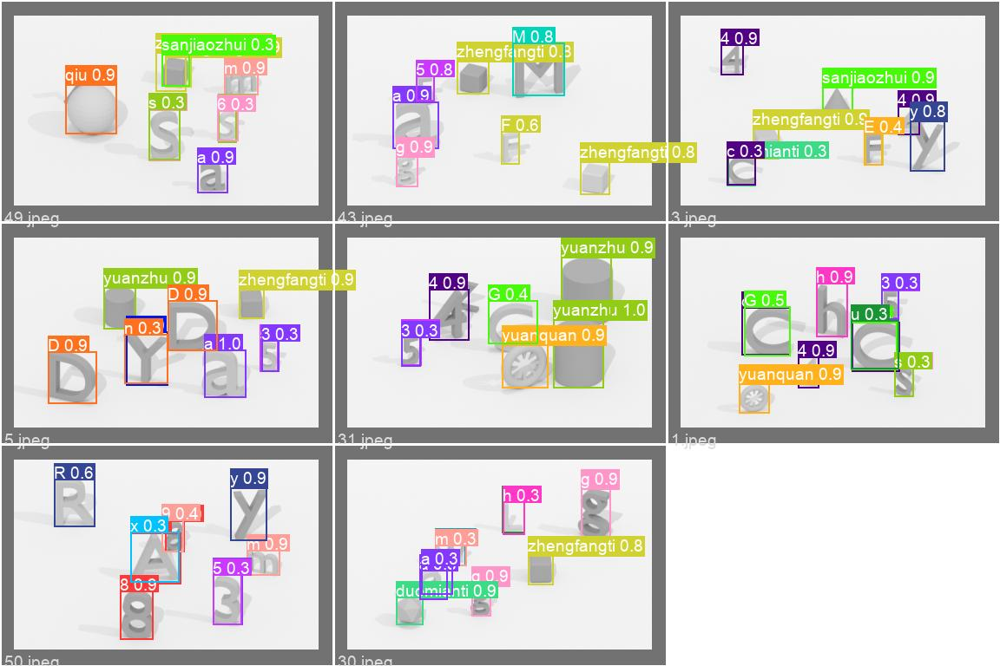

# cnn_for_captcha

**基于深度学习的图片验证码识别**

**建议1: 尝试此项目中的方法之前，首先确认能不能规避验证码，如果大部分情况下都能规避，就别看此项目了**

**建议2: 尝试此项目中的方法之前，首先确认验证码是不是暴力枚举就能把所有情况都列举出来**

****
## 1. 固定长度的文字验证码识别 
[fixed_length_captcha.py](fixed_length_captcha.py)

### 依赖
_**requirements.txt 这里面比较全可按需安装**_

### 1.1 输入要求
* 将训练集和验证集分别放到配置文件指定的目录中
* 目录中所有图片尺寸相同
* 图片命名规则 验证码_编号.图片格式, 举例 **abce_012312.jpg**

### 1.2 配置文件
* 默认文件 fixed_length_captcha.json
* 字段见文知义

### 1.3 训练
~~~ python
python fixed_length_captcha.py
~~~

### 1.4 预测
~~~ python
predictor = Predictor()
# 预测本地磁盘文件
predictor.predict('xxx.jpg')
# 直接二进制内容预测
predictor.predict_single_image_content(b'PNGxxxxx')
# 预测远程图片
predictor.predict_remote_image('http://xxxxxx/xx.jpg', save_image_to_file='remote.jpg')
~~~

### 1.5 效果
* 根训练集样本大小有关
*  这种图片2w张左右的训练集训练后实际能达到90%以上的准确率

****

## 2. 滑动验证码 
[slide_captcha.py](slide_captcha.py)

提供滑动验证码相关解决方法与思路
### 2.1 基于opencv2的match template
此方法简单易于验证, 配合一些规则即可达到满意效果
~~~python
import slide_captcha
slide_captcha.detect_displacement('image_slider.jpg', 'image_background.jpg')
~~~
以下是match template的效果

### 2.2 基于YOLOv5的检测
此方法需要标注数据以及进行训练但相对于模板探测是更稳定的通用方案

基于 [yolo v5](https://github.com/ultralytics/yolov5) 进行模型的训练与缺口探测

训练方法参考 [train custom data](https://github.com/ultralytics/yolov5/wiki/Train-Custom-Data)
~~~text
本项目中yolov5中提供了100张标注好的图片;
参数:
batch-size 根据可用内存或者显存以及训练效果进行调整
epochs 根据训练效果来定
yolov5s.yaml在yolov5项目的models下面
img 图片缩放基准 建议用图片的宽或者高即可(需要考虑图片大小 如果图片过大建议调低此值)
weights 设置预训练模型 没有则为空即可 推荐使用预训练yolov5s.pt

python train.py --batch-size 4 --epochs 200 --img 344 --data displacement.yaml --weights '' --cfg yolov5s.yaml
~~~

探测方法参考 [detect.py](https://github.com/ultralytics/yolov5/blob/master/detect.py) 中run方法 或者 使用slide_captcha.py中方法
~~~python
import slide_captcha
detector = slide_captcha.DisplacementFinderByYolo()
detector.load_models('best.pt')
detector.detect_displacement('image.jpg', 344)
~~~

下面是通过标注100张图片并经过训练得到的模型的探测效果

****

## 3. 点选文字验证码
文字点选类验证码一般是从图片中按照指定顺序选择目标文字

目标文字一般通过 "文字" 或者 "文字图片" 的方式给出

### 3.1 位置标定
1) 使用yolo类目标识别算法从图片中将候选文字所在的位置框标定出来 
2) 如果目标文字是通过"文字图片"的方式给出那么也需要使用yolo等将其从图片中标定出来

### 3.2 匹配
匹配是相对比较难的地方，需要根据不同情况进行实际的分析
* 如果图片中的文字能够再标定后通过ocr识别出来那么比较容易解决，直接用识别后的字符匹配即可。可用的ocr识别
[PaddleOCR](https://github.com/PaddlePaddle/PaddleOCR) /
[tesseract](https://github.com/tesseract-ocr/tesseract) /
[cnocr](https://github.com/breezedeus/cnocr)

* 很多验证码文字都进行的变形、加粗等处理，因此OCR不能有效的进行识别
   - 1 如果目标文字也是以图片形式提供，可以考虑使用CNN训练一个模型用来判定两张输入图片是否为同一汉字
   - 2 如果候选文字的范围有限，比如几百或者几千，可以考虑直接使用yolo等给出类别
   - 3 如果目标文字是通过文本的形式给出，那么可以考虑将文本转成图片，然后用 1 中的方式训练判别模型

****

## 4. 旋转类验证码 rotate_captcha.py
旋转类验证码要求将经过旋转后的图片旋转会正确的位置;

### 4.1 思路一 暴力破解 (某些网站验证码原图就百张左右)
如果能够"脱库"(图库非无限大)，那么可以人肉标定“正”的图片；然后一般旋转类图片旋转角度单为10-30度左右，可以自己旋转生成不同角度的图片；

拿到待旋转图片以后，通过图片相似度找到最相似图片得到其角度，从而计算出需要旋转的角度

图片相似度计算可以使用ResNet等网络提取图片特征，计算余弦距离来对比

### 4.2 思路二 深度学习训练
深度学习训练有两种思路，分别是回归和分类；

看作回归问题，那么就是训练模型的产出是一个旋转角度；

看作分类问题，训练输出就是一个旋转角度类型预测(比如按照30度进行旋转，分为12类，预测属于哪一类),
或者看作0/1分类， 0就是"不正图片", 1就是"正"图片 

**验证0/1分类:** 此方法对一张图片来说正的图片只有一张，而其它旋转角度有N张，造成验证的训练数据不均衡问题，实际效果较差

**验证回归测算旋转角度:** 此方法优于0/1分类

**验证角度分类** 未尝试

**rotate_captcha.py** 中将旋转看作了回归问题, 使用ResNet50进行特征的提取；

**[PULC 含文字图像方向分类模型](https://github.com/PaddlePaddle/PaddleClas/blob/develop/docs/zh_CN/PULC/PULC_text_image_orientation.md)** 这个paddlepaddle中实现文字图片旋转矫正的模型或许对我们能够有所启发

### 4.x tips
* 从目标网站验证码界面下载旋转验证码图片，这时会遇到同一张图片的N中不同旋转角度的图片，此时可以基于
[imagededup](https://github.com/idealo/imagededup) 模块中的基于CNN特征的find_duplicates方法实现相似图片的匹配

* 图片特征的提取可以尝试keras.application下面的其它模型; 可尝试自定义loss函数替代MSE

****

## 5. 点击相似物体验证码
此类验证码一般是让点击图片中相同或者相似的物体，一般物体的种类在可控范围内，因此可以尝试使用物体识别算法将图片中物体种类识别出来
然后进行比较

[sameobject_captcha.py](sameobject_captcha.py) 基于yolov5实现物体探测

**原图：**

**结果：**

### 5.1 训练
至少准备200+张标注过的图片, 图片越多越准确

训练方法参考  [yolov5 train custom data](https://github.com/ultralytics/yolov5/wiki/Train-Custom-Data)

> 如果用labelme标注可以使用[labelme_json_to_yolov5_format.py](labelme_json_to_yolov5_format.py)转换格式

### 5.2 结果
此项目中效果是300张标注数据在训练100轮后的结果

此项目中的物体是部分字母、数字、三角锥等，从结果中可以看到h/r, C/G, U和圆柱体等识别混乱或者有的识别错误，增加训练集数量应该可以降低错误率

****

## X.其它
### X.1 图片数据切分
将准备好的图片按照比例切分成训练集和验证集
~~~ python
python split_data.py all_image_dir train_image_dir validation_image_dir 0.9
~~~
参数:
* all_image_dir 准备好的图片目录
* train_image_dir 训练集图片目录
* validation_image_dir 验证集图片目录
* 0.9 训练集比例

以上目录需要提前创建

### X.3 深度学习训练资源
* 推荐直接使用阿里云/腾讯云等平台上的GPU按量计费资源，可在有限时间和费用的前提大最大化机器配置加快训练